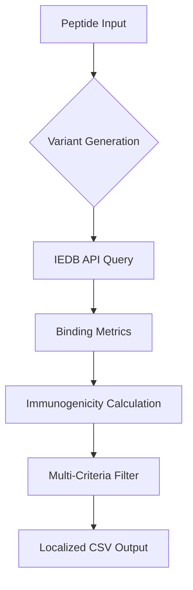

# MHC-I Binding Prediction Toolkit

## Scientific Overview

A Python-based computational pipeline for predicting peptide-MHC class I binding affinities and immunogenic potential. Leverages the Immune Epitope Database (IEDB) analysis resource's REST API while extending functionality with advanced post-processing and analytical capabilities.

Key components:
- **IEDB API Integration**: Programmatic interface to state-of-the-art binding prediction algorithms (NetMHCpan, SMM, ANN)
- **Immunogenicity Quantification**: Position-specific scoring matrix combining physicochemical amino acid properties
- **Multi-Parametric Analysis**: Unified evaluation of binding affinity (IC50), percentile rank, and immunogenicity
- **Regional Formatting**: Locale-aware CSV serialization with configurable decimal separators

## Technical Specifications

### Core Functionality
- Batch prediction processing for high-throughput epitope screening
- Combinatorial peptide variant generation from degenerate sequences
- Multi-threshold filtering system with logical conjunction of:
  - Binding score (continuous [0,1] likelihood)
  - Percentile rank (population frequency)
  - IC50 (nM binding affinity)
  - Computed immunogenicity index

### Architecture


### Data Flow
1. **Input**: Peptide sequences (raw or pattern-based variants)
2. **Processing**:
   - Parallel API requests to IEDB prediction servers
   - Matrix-based immunogenicity calculation
   - Data normalization (decimal formatting, unit conversion)
3. **Output**:
   - Comprehensive CSV with all prediction metrics
   - Filtered binder subsets meeting user-defined thresholds

## Usage Examples

### Basic Prediction
```bash
mhci_predict predict \
  --peptides epitope_candidates.txt \
  --alleles HLA-A*02:01,HLA-B*07:02 \
  --method netmhcpan_el
```

### Full Analysis Pipeline
```bash
mhci_predict full-analysis \
  --pattern "G[ILV][AG]STV" \
  --alleles HLA-A*24:02 \
  --length 9 \
  --output results.csv
```

### Result Filtering
```bash
mhci_predict filter \
  --input results.csv \
  --score 0.85 \
  --ic50 300 \
  --immunogenicity 1.2
```

## Technical Requirements

- **Python**: 3.8+ (with NumPy/pandas ecosystem)
- **Dependencies**: 
  - pandas >= 1.3.5 (tabular data processing)
  - requests >= 2.26.0 (API communication)
  - Click >= 8.0.3 (CLI framework)
- **Data Formats**: FASTA, CSV/TSV with configurable delimiters
- **Supported Alleles**: 45+ MHC I variants (HLA-A, HLA-B, H-2)

## Installation

```bash
pip install -e .
```


## Contributing & Support

This project adheres to:
- PEP8 coding standards
- Semantic versioning (v2.0.0)
- Conventional commits specification

Report issues via [GitHub tracker](https://github.com/yourusername/mhci-binding-predictor/issues).  
Submit contributions through protected `dev` branch with required CI checks.

## License

MIT License - See [LICENSE](LICENSE.md) for full text.

